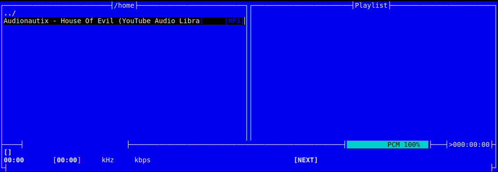
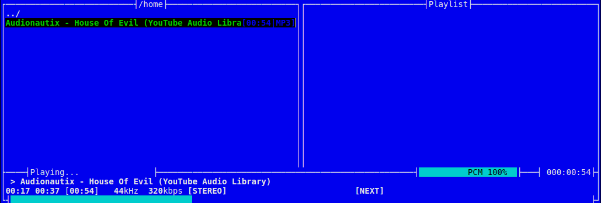

# Compartir dispositivo con contenedor
 
 ### Docker flag --device host a contenedor

 - Ejemplo reproducir sonido desde terminal en contenedor

```shell
# prueba inicial contenedor con imagen de ubuntu que se auto destruya al salir
# entrar en directorio de ejemplo con archivo mp3 de prueba
cd compartir_dispositivo
docker run --rm -it -v $PWD:/home ubuntu bash

# actualizar repositorios de software
root@f882c8b3f886:/ apt-get update

Get:1 http://security.ubuntu.com/ubuntu bionic-security InRelease [88.7 kB]
Get:2 http://archive.ubuntu.com/ubuntu bionic InRelease [242 kB]
Get:3 http://security.ubuntu.com/ubuntu bionic-security/main amd64 Packages [857 kB]
...
Fetched 17.7 MB in 2min 5s (141kBs)
Reading package lists... Done

# instalar herramienta de reproduccion de cli
apt-get install moc moc-ffmpeg-plugin

Reading package lists... Done
Building dependency tree       
Reading state information... Done
The following additional packages will be installed:
...
Do you want to continue? [Y/n] Y
...
aspell-autobuildhash: processing: en [en_US-w_accents-only].
aspell-autobuildhash: processing: en [en_US-wo_accents-only].
Processing triggers for libgdk-pixbuf2.0-0:amd64 (2.36.11-2) ...

# ver archivo de audio en el contenedor
root@f882c8b3f886:/ cd home && ls
House_Of_Evil.mp3

# tratar de iniciar mocp
root@f882c8b3f886:/home# mocp

Running the server...
Trying JACK...
Trying ALSA...
Trying OSS...

FATAL_ERROR: No valid sound driver!


FATAL_ERROR: Server exited!

root@f882c8b3f886:/home# exit

# salir y probar con el flag --device, obtener listado driver snd ls -l /dev/snd/
docker run --rm -it -v $PWD:/home --device /dev/snd/controlC0 --device /dev/snd/pcmC0D0p --device /dev/snd/timer ubuntu bash

# repetir pasos anterior para instalar mocp
root@45c58404909:/ apt-get update
root@45c58404909:/ apt-get install moc moc-ffmpeg-plugin

# ver archivo de audio en el contenedor
root@45c58404909:/ cd home && ls
House_Of_Evil.mp3

# tratar de iniciar mocp
root@45c58404909:/home# mocp

# probar interfaz iniciada, hacer enter en archivo mp3
```





- Probar con otros tipo de aplicaciones y comunicar displays

    Enlace de referencia: https://github.com/jessfraz/dockerfiles

    - Ejemplo vscode: github.com/jessfraz/dockerfiles/blob/master/vscode

```shell
# Dockerfile
# Visual Studio Code in a container
# NOTE: Needs the redering device (yeah... idk)

FROM debian:bullseye-slim
LABEL maintainer "Jessie Frazelle <jess@linux.com>"

# Tell debconf to run in non-interactive mode
ENV DEBIAN_FRONTEND noninteractive

RUN apt-get update && apt-get install -y \
	apt-transport-https \
	ca-certificates \
	curl \
	gnupg \
	--no-install-recommends

# Add the vscode debian repo
RUN curl -sSL https://packages.microsoft.com/keys/microsoft.asc | gpg --dearmor | apt-key add -
RUN echo "deb [arch=amd64] https://packages.microsoft.com/repos/vscode stable main" > /etc/apt/sources.list.d/vscode.list

RUN apt-get update && apt-get -y install \
	code \
	git \
	libasound2 \
	libatk1.0-0 \
	libcairo2 \
	libcups2 \
	libexpat1 \
	libfontconfig1 \
	libfreetype6 \
	libgtk2.0-0 \
	libpango-1.0-0 \
	libx11-xcb1 \
	libxcomposite1 \
	libxcursor1 \
	libxdamage1 \
	libxext6 \
	libxfixes3 \
	libxi6 \
	libxrandr2 \
	libxrender1 \
	libxss1 \
	libxtst6 \
	openssh-client \
	--no-install-recommends \
	&& rm -rf /var/lib/apt/lists/*

ENV HOME /home/user
RUN useradd --create-home --home-dir $HOME user \
	&& chown -R user:user $HOME

COPY start.sh /usr/local/bin/start.sh

WORKDIR $HOME

CMD [ "start.sh" ]

# start.sh
#!/bin/bash
set -e
set -o pipefail

su user -p -c /usr/share/code/code

# construir imagen
docker build -t vscode .

# ejecutar contenedor
docker run -d \
-v /tmp/.X11-unix:/tmp/.X11-unix \
-v $HOME:/home/user \
-e DISPLAY=unix$DISPLAY \
--device /dev/dri \
--name vscode \
vscode

# se abre instancia de vscode desde el contenedor
```    