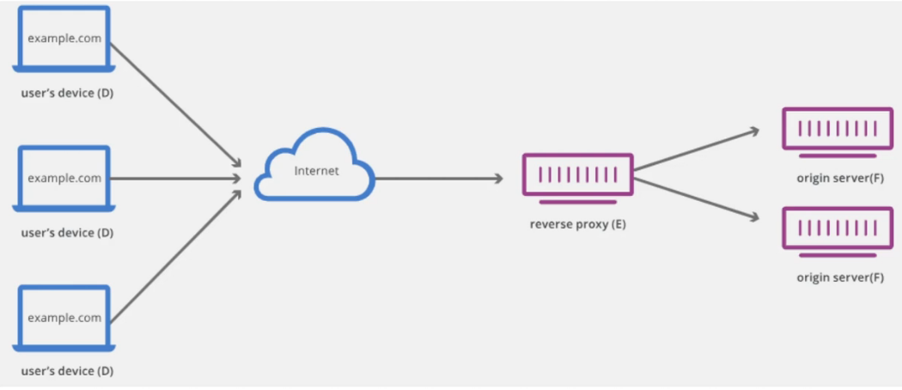
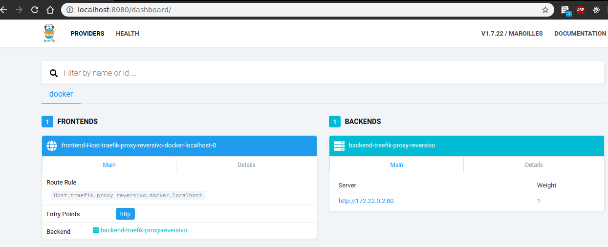
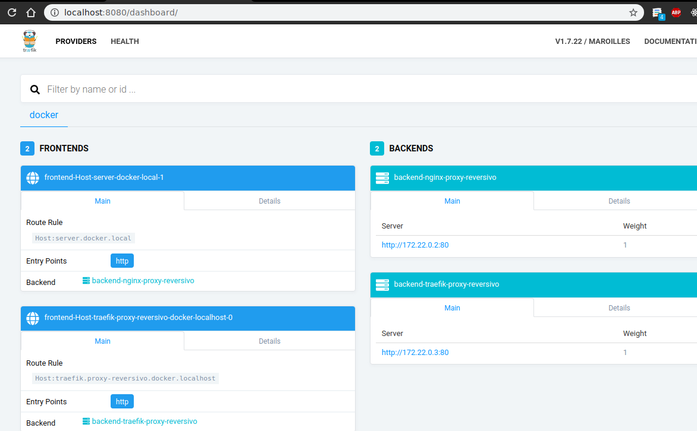
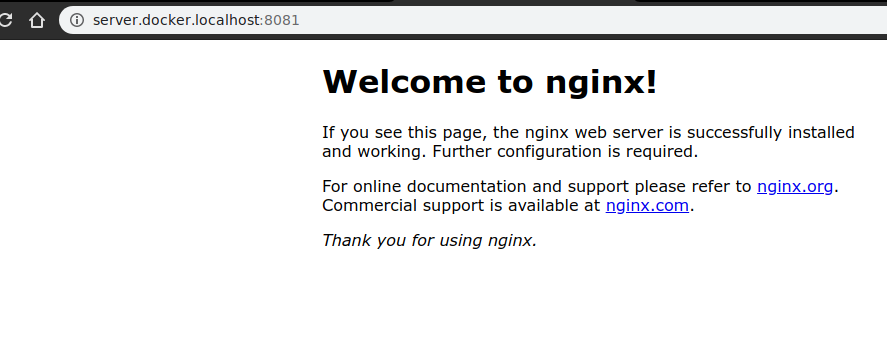

# Proxy reversivo
 
- Ejemplo bases proxy reversivo

    Herramienta caso de uso: https://docs.traefik.io/

    Imagen Docker de Traefik: https://hub.docker.com/_/traefik


Diagrama de ejemplo

 

 
 [docker-compose.yml](./proxy_reversivo/docker-compose.yml) editado

 
 [traefik.toml](./proxy_reversivo/traefik.toml) editado

```shell
# directorio de ejemplo para usar con docker-compose
cd proxy_reversivo

code docker-compose.yml

# editar configuraciones docker-compose.yml
version: "3.7"

services:
    traefik:
        image: traefik:v1.7
        ports: 
            - 8080:8080
            - 80:80
        volumes: 
            - $PWD/traefik.toml:/etc/traefik/traefik.toml
            - /var/run/docker.sock:/var/run/docker.sock

# agregar archivo traefik.toml para cofiguraciones que usara la imagen
code traefik.toml

# editar configuraciones traefik.toml

[api]

[docker]
  endpoint = "unix:///var/run/docker.sock"
  domain = "docker.localhost"
  watch = true

# ejecutar docker-compose para descargar imagen
# y crean contenedor con las configuraciones
docker-compose up -d

Creating network "proxy_reversivo_default" with the default driver
Pulling traefik (traefik:v1.7)...
v1.7: Pulling from library/traefik
e40d0b92fe2d: Pull complete
3c068c504967: Pull complete
f203ccc96c78: Pull complete
Digest: sha256:15edd6d0ea71a9707b8a04990d092e3991bb59e4c38a169fe560eb209fe68d62
Status: Downloaded newer image for traefik:v1.7
Creating proxy_reversivo_traefik_1 ... done

# ver contenedores en ejecución
docker ps

CONTAINER ID  IMAGE         COMMAND      CREATED              PORTS                                        NAMES
26628dd74ec2  traefik:v1.7  "/traefik"   About a minute ago   0.0.0.0:80->80/tcp, 0.0.0.0:8080->8080/tcp   proxy_reversivo_traefik_1

# probar respuesta en host local
```




- Agregar servicio para acceso con traefik

    Doc configuraciones Docker: https://docs.traefik.io/v1.7/configuration/backends/docker/

    Info labels: https://docs.traefik.io/v1.7/configuration/backends/docker/#labels-overriding-default-behavior

```shell
# modificar docker-compose.yml
version: "3.7"

services:
    traefik:
        image: traefik:v1.7
        ports: 
            - 8080:8080
            - 80:80
        volumes: 
            - $PWD/traefik.toml:/etc/traefik/traefik.toml
            - /var/run/docker.sock:/var/run/docker.sock
    nginx:
        image: nginx
        labels: 
            - "traefik.frontend.rule=Host:server.docker.local"
            - "traefik.enable=true"
        ports: 
            - 8081:80

# recrear contenedor creado previamente 
docker-compose up -d --force-recreate

Recreating proxy_reversivo_traefik_1 ... done
Creating proxy_reversivo_nginx_1     ... done

# probar respuesta en host local
```



ver respuesta servicio frontend

