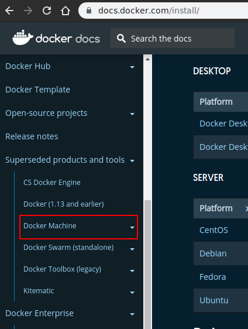
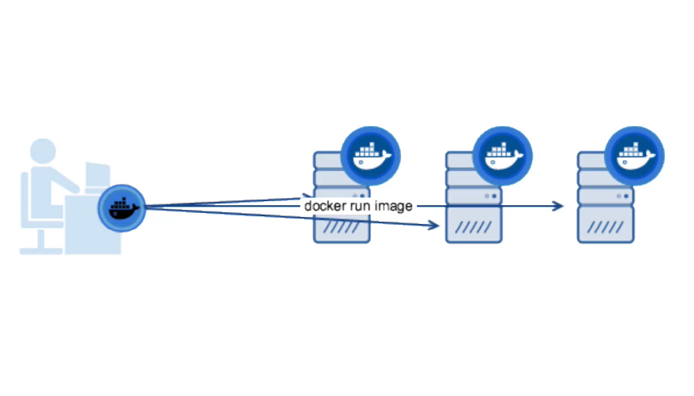

# Overview

### Herramienta para instalar Docker en maquinas virtuales

    - windows - docker tools - virtualbox - digitalocean - aws - etc

- Doc instalación: https://docs.docker.com/machine/install-machine/

#### Contenedores en maquinas remotas
