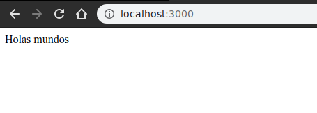

# Contenerizar app

### Imagen de referencia: https://hub.docker.com/_/node

- Ejemplo nodejs simple app

    [index.js](./contenerizar_app/index.js) editado
    [Dockerfile](./contenerizar_app/Dockerfile) editado

```js
// crear archivo js en algun directorio de ejemplo
// cd contenerizar_app
// editar index.js
const express = require('express')
const app = express()

app.get('/',(req, res)=>res.send('Holas mundos'))
app.listen(3000,()=>console.log("Watahea"))
```

```shell
cd contenerizar_app
# usando formas cortas ->
# descargar imagen de node
docker pull node
# salida
Using default tag: latest
latest: Pulling from library/node
c0c53f743a40: Pull complete 
66997431d390: Pull complete 
0ea865e2909f: Pull complete 
584bf23912b7: Pull complete 
3c4c73959f29: Pull complete 
63e05266fc4b: Pull complete 
7b37ba8cd979: Pull complete 
3a18f94fe18a: Pull complete 
a000f3263f8b: Pull complete 
Digest: sha256:4fcd09f342507ff3638771bb60efa36c283fa987f6a0f6f036b8b8c154112e27
Status: Downloaded newer image for node:latest
docker.io/library/node:latest

# ejecutar nuevo contenedor, agregando flag -w para workdir ubicado por defecto
pwd # obtener ruta de trabajo OS
/home/usuario/docker-facilito/images/contenerizar_app
# nuevo contenedor de prueba con volumen al working directory para acceder
docker run --rm -w /app -v /home/usuario/docker-facilito/images/contenerizar_app:/app -it node bash
# salida
root@5f21ce1d73c1:/app# 
# nuevo contenedor de prueba para generar package.json en workdir
docker run --rm -w /app -v /home/usuario/docker-facilito/images/contenerizar_app:/app -it node npm init -y
# salida y archivo generado en el directorio actual
Wrote to /app/package.json:

{
  "name": "app",
  "version": "1.0.0",
  "description": "",
  "main": "index.js",
  "scripts": {
    "test": "echo \"Error: no test specified\" && exit 1"
  },
  "keywords": [],
  "author": "",
  "license": "ISC"
}
# nuevo contenedor de prueba para instalar dependencias en workdir
docker run --rm -w /app -v /home/usuario/docker-facilito/images/contenerizar_app:/app -it node npm install -S express
# salida y node_modules generado en el directorio actual
npm notice created a lockfile as package-lock.json. You should commit this file.
npm WARN app@1.0.0 No description
npm WARN app@1.0.0 No repository field.

+ express@4.17.1
added 50 packages from 37 contributors and audited 126 packages in 11.667s
found 0 vulnerabilities

# continuar eliminando directorio de node_modules previo
sudo rm -r node_modules

# definir contenerizacion imagen app usando Dockerfile, editando
FROM node

WORKDIR /app

COPY package.json .

RUN npm install

COPY index.js .

ENTRYPOINT ["node"]

CMD ["index.js"]

# generar imagen de ejemplo usando el Dockerfile editado
docker image build -t webapp .
#salida
Sending build context to Docker daemon  18.94kB
Step 1/7 : FROM node
 ---> 7aef30ae6655
Step 2/7 : WORKDIR /app
 ---> Running in 61252496bfc6
Removing intermediate container 61252496bfc6
 ---> fda20de76553
Step 3/7 : COPY package.json .
 ---> c4aa9e251646
Step 4/7 : RUN npm install
 ---> Running in 2f406d59cdc4
npm notice created a lockfile as package-lock.json. You should commit this file.
npm WARN app@1.0.0 No description
npm WARN app@1.0.0 No repository field.

added 50 packages from 37 contributors and audited 126 packages in 12.236s
found 0 vulnerabilities

Removing intermediate container 2f406d59cdc4
 ---> f76ebd1906c3
Step 5/7 : COPY index.js .
 ---> 70ab47503e1f
Step 6/7 : ENTRYPOINT ["node"]
 ---> Running in d52152284487
Removing intermediate container d52152284487
 ---> ad747fe41f9b
Step 7/7 : CMD ["index.js"]
 ---> Running in 1ef07eeccc0c
Removing intermediate container 1ef07eeccc0c
 ---> fa3da8675ff6
Successfully built fa3da8675ff6
Successfully tagged webapp:latest

# ejecutar nuevo contenedor de imagen creada previamente, uso flag -p de exponer puertos, sistema:contenedor
docker run -d -p 3000:3000 webapp
# salida
3e3519cb572807e6f6f2000a7db37337881d8827e7508a272e0867813ca08837
# revisar contenedores en ejecucion actual
docker ps
# salida
CONTAINER ID     IMAGE      COMMAND             CREATED           STATUS          PORTS
3e3519cb5728     webapp     "node index.js"     14 seconds ago    Up 10 seconds   0.0.0.0:3000->3000/tcp

# probar ejecucion webapp
curl localhost:3000
# salida terminal
Holas mundos
# salida navegador
```
