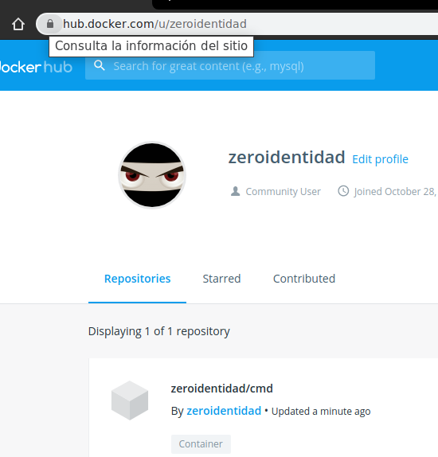

# Subir imagen a Docker Hub

- Pasos de ejemplo

1. Tener cuenta de usuario en: https://hub.docker.com/

2. Iniciar sesion con esos mismos datos en la CLI de Docker

```shell
# iniciar sesion desde la terminal
docker login
#salida
Login with your Docker ID to push and pull images from Docker Hub. If you don't have a Docker ID, head over to https://hub.docker.com to create one.
Username: tuusuario
Password: 
WARNING! Your password will be stored unencrypted in /home/usuario/.docker/config.json.
Configure a credential helper to remove this warning. See
https://docs.docker.com/engine/reference/commandline/login/#credentials-store

Login Succeeded
```

3. Ver que imagen seleccionar

```shell
# listar imagenes creadas localmente
docker image ls
# salida
REPOSITORY          TAG                 IMAGE ID            CREATED             SIZE
webapp              latest              fa3da8675ff6        3 hours ago         946MB
cmd                 v3                  133d89781cae        8 hours ago         64.2MB
cmd                 v2                  f5dc0f9148be        8 hours ago         64.2MB
```

4. Renombrar imagen elegida con parte username

```shell
# para ejemplo rapido se elige imagen ligera, cmd:v3 
# y se cambia nombre: tag nombreimg username/nombreimg
docker tag cmd:v3 zeroidentidad/cmd:v3
# revisar modificacion
REPOSITORY          TAG                 IMAGE ID            CREATED             SIZE
webapp              latest              fa3da8675ff6        3 hours ago         946MB
cmd                 v3                  133d89781cae        8 hours ago         64.2MB
zeroidentidad/cmd   v3                  133d89781cae        8 hours ago         64.2MB
```

5. Uso comandos de docker push 

```shell
# ver ayuda de los comandos
docker push  --help
# subir usando la imagen con nombre modificado, ej. zeroidentidad/cmd:v3
docker push zeroidentidad/cmd:v3
# salida
The push refers to repository [docker.io/zeroidentidad/cmd]
1852b2300972: Mounted from library/ubuntu 
03c9b9f537a4: Mounted from library/ubuntu 
8c98131d2d1d: Mounted from library/ubuntu 
cc4590d6a718: Mounted from library/ubuntu 
v3: digest: sha256:eeb753a81e94c92d1d93bf6dd8ea265a5afb3d3dfa73281bbdacd7bc10cec3fd size: 1152
```
Vista en perfil web

