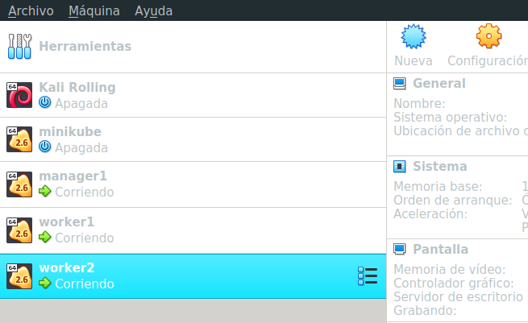

# Docker swarm

- Creación maquinas virtuales de ejemplo (docker machine - virtualbox)

```shell
# creación maquinas de ejemplo con docker machine
docker-machine create -d virtualbox manager1

Running pre-create checks...
Creating machine...
(manager1) Copying /home/usuario/.docker/machine/cache/boot2docker.iso to /home/usuario/.docker/machine/machines/manager1/boot2docker.iso...
(manager1) Creating VirtualBox VM...
(manager1) Creating SSH key...
(manager1) Starting the VM...
(manager1) Check network to re-create if needed...
(manager1) Waiting for an IP...
Waiting for machine to be running, this may take a few minutes...
Detecting operating system of created instance...
Waiting for SSH to be available...
Detecting the provisioner...
Provisioning with boot2docker...
Copying certs to the local machine directory...
Copying certs to the remote machine...
Setting Docker configuration on the remote daemon...
Checking connection to Docker...
Docker is up and running!
To see how to connect your Docker Client to the Docker Engine running on this virtual machine, run: docker-machine env manager1

# creación resto maquinas
docker-machine create -d virtualbox worker1

docker-machine create -d virtualbox worker2

# lista maquinas creadas
docker-machine ls 
NAME       ACTIVE   DRIVER       STATE     URL                         SWARM   DOCKER     ERRORS
manager1   -        virtualbox   Running   tcp://192.168.99.102:2376           v19.03.5   
worker1    -        virtualbox   Running   tcp://192.168.99.103:2376           v19.03.5   
worker2    -        virtualbox   Running   tcp://192.168.99.104:2376           v19.03.5 

# vista UI virtualbox
```


- Swarm con maquinas virtuales en ejecución

```shell
# acceder a maquina manager1 por ssh
docker-machine ssh manager1

   ( '>')
  /) TC (\   Core is distributed with ABSOLUTELY NO WARRANTY.
 (/-_--_-\)           www.tinycorelinux.net

docker@manager1:~$ 

# ejecución init swarm en maquina actual (ip 192.168.99.102)
docker@manager1:~$ docker swarm init --advertise-addr 192.168.99.102

Swarm initialized: current node (7tn2zpmalg5cye47kdloy26ns) is now a manager.

To add a worker to this swarm, run the following command:

    docker swarm join --token SWMTKN-1-3kiizxhq7wb8saaq9jakz5jwz7tsegsjvqq0pi2d706e88h20o-92m1dkwgxqe3jv25a3ikr58ny 192.168.99.102:2377

To add a manager to this swarm, run 'docker swarm join-token manager' and follow the instructions.

docker@manager1:~$ exit
logout

# agregar workers al swarm del manager previo
docker-machine ssh worker1

   ( '>')
  /) TC (\   Core is distributed with ABSOLUTELY NO WARRANTY.
 (/-_--_-\)           www.tinycorelinux.net

docker@worker1:~$ 

# agregar sentencia para agregarse al nodo de la maquina manager
docker@worker1:~$ docker swarm join --token SWMTKN-1-3kiizxhq7wb8saaq9jakz5jwz7tsegsjvqq0pi2d706e88h20o-92m1dkwgxqe3jv25a3ikr58ny 192.168.99.102:2377

This node joined a swarm as a worker.

docker@worker1:~$ exit
logout

docker-machine ssh worker2

   ( '>')
  /) TC (\   Core is distributed with ABSOLUTELY NO WARRANTY.
 (/-_--_-\)           www.tinycorelinux.net

docker@worker2:~$ 

# agregar sentencia para agregarse al nodo de la maquina manager
docker@worker2:~$ docker swarm join --token SWMTKN-1-3kiizxhq7wb8saaq9jakz5jwz7tsegsjvqq0pi2d706e88h20o-92m1dkwgxqe3jv25a3ikr58ny 192.168.99.102:2377

This node joined a swarm as a worker.

docker@worker2:~$ exit
logout
```

- Gestion Swarm desde el manager 

```shell
# acceder a maquina manager1 por ssh
docker-machine ssh manager1

# ver nodos
docker node ls

ID                            HOSTNAME     STATUS    AVAILABILITY     MANAGER STATUS      ENGINE VERSION
7tn2zpmalg5cye47kdloy26ns *   manager1     Ready     Active           Leader              19.03.5
gyg6ros9ft2jqpkizlwscv583     worker1      Ready     Active                               19.03.5
i38hw0fjukjnvdlvdt8hpsith     worker2      Ready     Active                               19.03.5
```