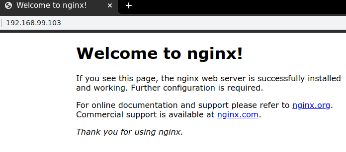
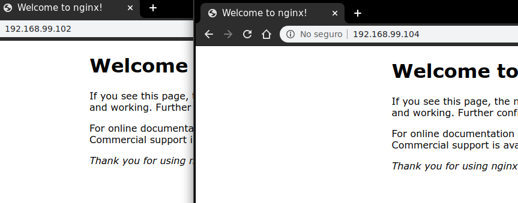

# Docker swarm actualizar puertos

- Exponer servicio al exterior del nodo

```shell
# acceder a la maquina manager
docker-machine ssh manager1

   ( '>')
  /) TC (\   Core is distributed with ABSOLUTELY NO WARRANTY.
 (/-_--_-\)           www.tinycorelinux.net

docker@manager1:~$

# ver ayuda comandos update servicios
docker service update --help

Usage:	docker service update [OPTIONS] SERVICE

Update a service

Options:
      --args command                       Service command args
      --config-add config                  Add or update a config file on a service
      --config-rm list                     Remove a configuration file
      --constraint-add list                Add or update a placement constraint
      --constraint-rm list                 Remove a constraint
      --container-label-add list           Add or update a container label
      --container-label-rm list            Remove a container label by its key
      --credential-spec credential-spec    Credential spec for managed service account (Windows only)
  -d, --detach                             Exit immediately instead of waiting for the service to converge
      .....
  -u, --user string                        Username or UID (format: <name|uid>[:<group|gid>])
      --with-registry-auth                 Send registry authentication details to swarm agents
  -w, --workdir string                     Working directory inside the container

# agregar otro servicio de ejemplo
docker service create --replicas 1 --name nginx nginx
uyv9bxqcf7b3a9oey3znce9xj
overall progress: 1 out of 1 tasks 
1/1: running   [==================================================>] 
verify: Service converged

# ver servicios existentes
docker service ls

ID                  NAME        MODE           REPLICAS        IMAGE
uyv9bxqcf7b3        nginx       replicated     1/1             nginx:latest
xxouscqvq3cb        redis       replicated     1/1             redis:4

# inspeccionar servicio creado
docker service ps nginx
ID             NAME       IMAGE           NODE         DESIRED STATE     CURRENT STATE
kwzg12urdkgq   nginx.1    nginx:latest    worker1      Running           Running 20 minutes ago

# update servicio para exponer puerto externo:contenedor
docker service update --publish-add 80:80 nginx

nginx
overall progress: 1 out of 1 tasks 
1/1: running   [==================================================>] 
verify: Service converged

# inspeccionar servicio modificado
docker service ps nginx

ID               NAME         IMAGE           NODE       DESIRED STATE       CURRENT STATE               PORTS
0ysqc0vaos5k    nginx.1       nginx:latest    worker1    Running             Running 49 seconds ago
kwzg12urdkgq    \_ nginx.1    nginx:latest    worker1    Shutdown            Shutdown 51 seconds ago

# revisar en worker1 contenedor servicio en ejecucion
docker@worker1:~$ docker ps
CONTAINER ID   IMAGE           COMMAND                  CREATED        STATUS         PORTS     NAMES
f3567573e661   nginx:latest    "nginx -g 'daemon of…"   3 minutes ago  Up 3 minutes   80/tcp    nginx.1.0ysqc0vaos5kpdfluw5r11qcd

# probar acceder desde el navegador en el host a la maquina worker1
# ver ip maquinas virtuales
chucho@enigma:~$ docker-machine ls
NAME       ACTIVE   DRIVER       STATE     URL                         SWARM   DOCKER
manager1   -        virtualbox   Running   tcp://192.168.99.102:2376           v19.03.5   
worker1    -        virtualbox   Running   tcp://192.168.99.103:2376           v19.03.5   
worker2    -        virtualbox   Running   tcp://192.168.99.104:2376           v19.03.5

# respuesta navegador
```


- Otro ejemplo con modificar numero de replicas

```shell
# acceder a la maquina manager
docker-machine ssh manager1

   ( '>')
  /) TC (\   Core is distributed with ABSOLUTELY NO WARRANTY.
 (/-_--_-\)           www.tinycorelinux.net

docker@manager1:~$

# ver ayuda comandos update servicios
docker service update --help

# sentencia update replicas servicio
docker service update --replicas 3 nginx


# inspeccionar servicio modificado
docker service ps nginx
nginx
overall progress: 3 out of 3 tasks 
1/3: running   [==================================================>] 
2/3: running   [==================================================>] 
3/3: running   [==================================================>] 
verify: Service converged

# inspeccionar servicio modificado
docker service ps nginx

ID              NAME            IMAGE           NODE          DESIRED STATE       CURRENT STATE
0ysqc0vaos5k    nginx.1         nginx:latest    worker1       Running             Running 22 minutes ago                           
kwzg12urdkgq    \_ nginx.1      nginx:latest    worker1       Shutdown            Shutdown 22 minutes ago                          
wrvz8zmyipar    nginx.2         nginx:latest    worker2       Running             Running about a minute ago                       
r1t5470zx0cs    nginx.3         nginx:latest    manager1      Running             Running about a minute ago

# respuesta navegador desde worker2 o manager1
```
