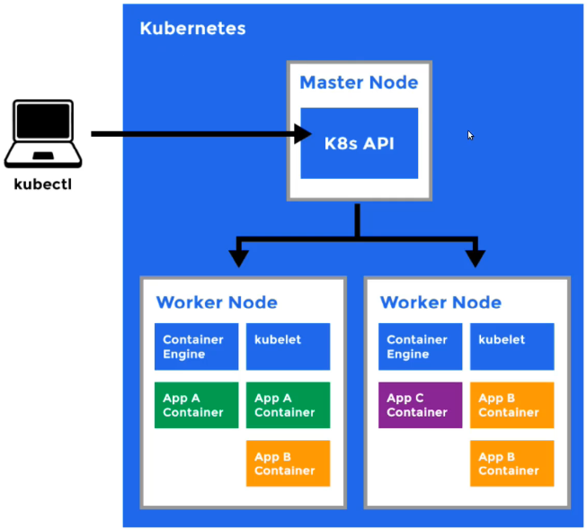
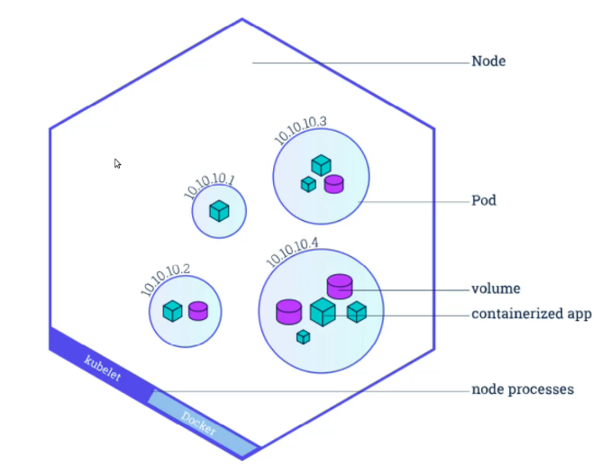

# Kubernetes conceptos

- Conceptos clave

    - Kubectl: Herramienta de CLI para comunicacion con API de Kubernetes
    - Master Node: Maquina principal o manager para controlar los nodos
    - Worker Node: Nodo realizador de tareas recibidas y controladas por nodo master
    - Kubelet: Agente o proceso en background en cada nodo para verificar estados contenedores
    - Kubernetes Pod: Objeto de Kubernetes abstracción de contenedor para encapsular objetos de contenedores o contendedores y estando en cojunto pero aislados
    - Deployment: Capa de abstracción consiguiente de los Pod, para poder recrearlos y usar configuración de Deploy de contenedores del Pod

    Ilustración general

      

    Representación Pod de Kubernetes 

    