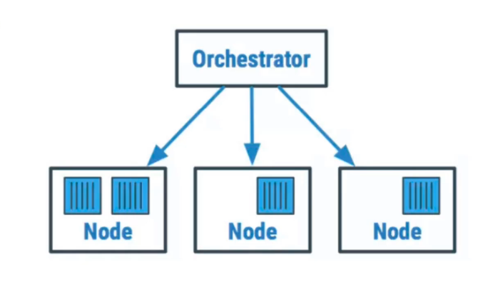
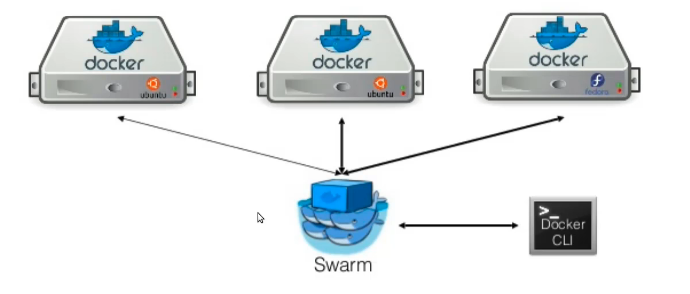

# Overview
 
 - Organización e integración de contenedores de formas posibles

### Herramientas de orquestción

    - Docker Swarm
    - Kubernetes

### Conceptos clave

    - Nodos
    - Swarm
    - Servicios
    - Tareas

Ilustración Swarm

